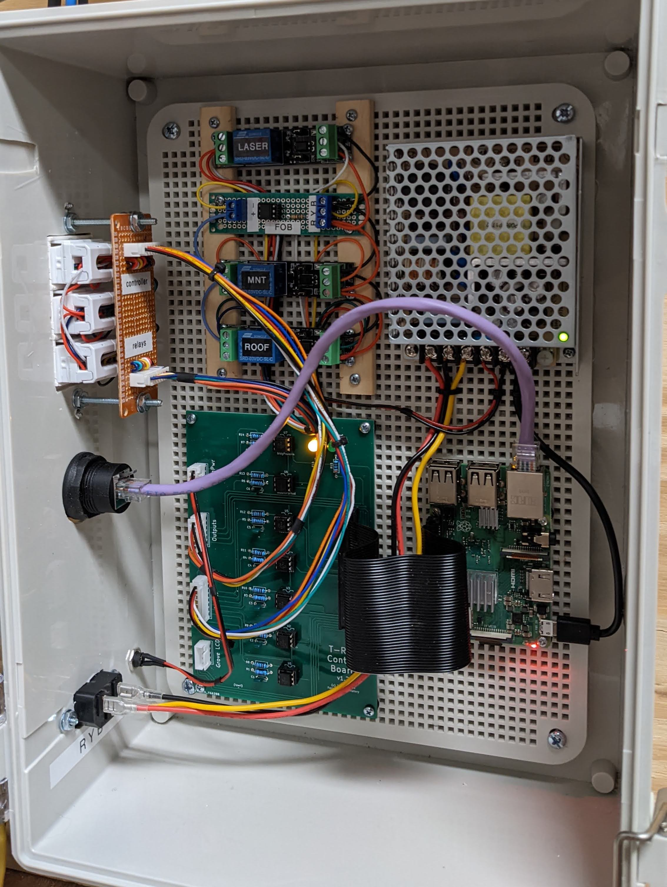
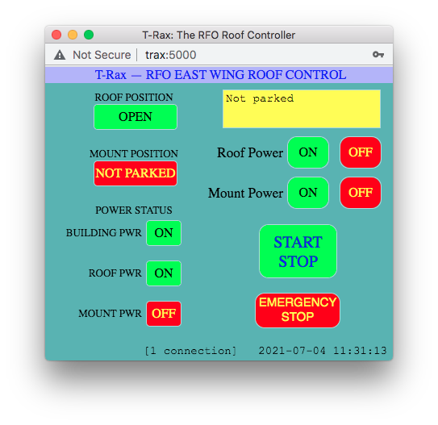
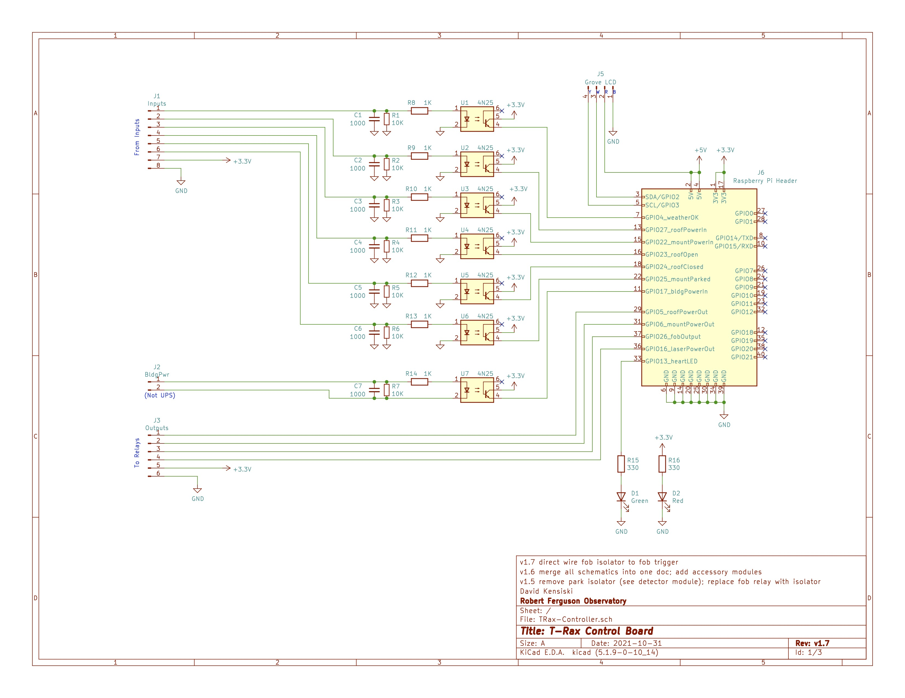
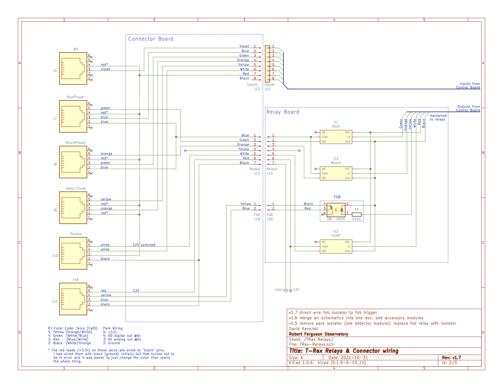
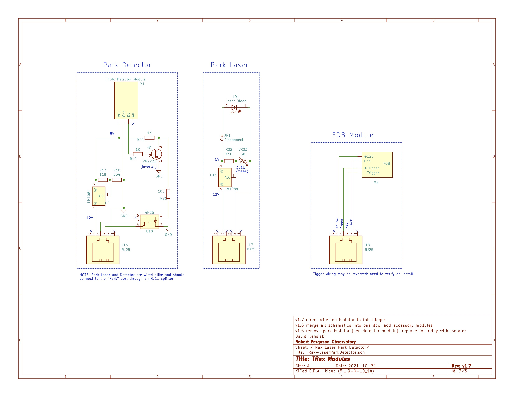

# T-Rax Raspberry Pi Notes

This is the Raspberry Pi implementation of the T-Rax roof controller for the Robert Ferguson Observatory
[rfo.org](https://rfo.org).

This design is a logical follow-on to the [Arduino T-Rax](https://github.com/votmoa/trax-arduino) roof controller
created back in 2017 by Jim Finn, David Kensiski and Jay Pacheco.  The switch to the Raspberry Pi was driven by the desire
to implement an [ASCOM Alpaca](https://ascom-standards.org/Developer/Alpaca.htm) interface so that the roof
can be opened via automation through tools such as [ACP](https://acpx.dc3.com/).

Note that version 1 will simply replace the Arduino functionality.  The ASCOM Alpaca interface will not be
available unitl version 2.

Testing insturctions can be found in the [test plan](doc/TestPlan.md) document.

Version history can be found in [VERSION.md](VERSION.md).

# Table of Contents

1. [Theory of Operation](#theory-of-operation)
1. [Detailed Design](#detailed-design)
1. [Hardware Design](#hardware-design)
1. [Future Plans](#future-plans)
1. [Installation](#installation)
1. [GPIO Notes](#gpio-notes)

# Theory of Operation

The server is written in Python 3 and utilizes only two external libraries:
[GPI Zero](https://gpiozero.readthedocs.io/en/stable/) to control the Raspberry Pi GPIO ports, and
[Flask](https://flask.palletsprojects.com/en/1.1.x/) to manage the web interface.  (Though Flask
has a bunch of prerequisites that also need to be loaded.)
The Browser panel is written in [HTML](https://www.w3schools.com/html/default.asp) using
Cascading Style Sheets ([CSS](https://www.w3schools.com/css/default.asp)) to control the apperance of the page, and
[Javascript](https://www.w3schools.com/js/default.asp) to handle communication and control the modal dialogs.

The overall software design is driven through interrupts -- there is no "main loop" as there was in the Arduino.
On start, the server sets  up logging, initializes each of the
GPIO pins, registers the web interface callbacks, then hands operation over to Flask to listen for incoming requests.
There are three flavors of threads:

* Hardware input state changes trigger GPI Zero callbacks that execute in individual threads.
* Browser reqeusts trigger Flask actions that execute in separte threads.
* Finally an "update" thread executes every second to perform household chores.

There is a static html launcher page that is currently served directly by Apache.  This sets browser window size
(I don't think a window can reliably change its size once launched) and points it at http://trax:5000 which is where
trax.py is listening (by way of Flask).  This sends a template web page to paint the browser.  Once painted,
Javascript in the browser connects back to trax and and set up a server-sent events channel
([SSE](https://developer.mozilla.org/en-US/docs/Web/API/Server-sent_events))
so the server can pro-actively update the browser.  Browser javascript listens on this channel and paints the
display appropriately.  Browser buttons trigger async HTTP calls to varioius
trax URIs that perform an appropriate action, which in turn triggers an SSE response.

Breaking this down, the connection flow is as follows:

1. User connects to http://trax and clicks the "Launch" button
1. Browser launches the T-Rax browser window pointing to http://trax:5000
1. Server sends static HTML, CSS and Javascript to paint the browser
1. After panting, browser javascript connects to http://trax:5000/connect to set up SSE channel

Then in normal operation:

* Server sends events via SSE when something changes
  * Browser executes javascript to handle the event
* Browser buttons send HTTP asynchronous requests to http://trax:5000/{whatever} to trigger actions
  * Sever performs the actions and responsds via SSE

The update thread is simply a thread that runs on startup to perform household chores and proactively update the
browser.  It then reschedules itself to run again one second later.  This thread updates the clock on the T-Rax
page to act as a hardbeat to confirm the server/browser SSE channel is active

# Software Design

* TODO: Flesh this out

* Hardware Interrupt driven
* Each input has a callback
* Wrapper around gpiozero to track output changes

* Browser
* calls links that trigger functions to perform operations
* Check safety logic, trigger outputs
* Send SSE
* Javascript paints browser

* Buttons are (actually `
` onClick actions)

* Update thread 

# Hardware Design

The system is built around a [Raspberry Pi 3 B+](https://www.raspberrypi.org/products/raspberry-pi-3-model-b-plus/)
computer, though any Pi that sports the 40-pin GPIO header should work.  The header is routed to a custom circuit
board that splits out the GPIO inputs and outputs.  Output ports are fed to a 6-pin connetor that connects to the
relay board (see below).  Inputs are fed through RC low-pass filters (to reduce the effect
of electrical noise), current limiting resistors and optoisolators which ultimately deliver 3.3v to GPIO input ports.

External connectors are wired to jacks on a connecor board to maintain modularity.  Inputs are fed via an 8-pin
connector to the control board.  Outputs connect via a wiring harness from the 6-pin connector on the control board.
The roof and mount outputs directly feed relays to close a nomrally open circuit that in turn closes a relay circuit
in each of the remote roof and mount power controllers (not shown).

KiCad schematics and circuit board layout are available in the [KiCad](KiCad) subdirectory.
The full schematic is also available as a PDF: [TRax-Schematic.pdf](KiCad/TRax-Schematic.pdf)

### WeatherOK

This is the hardware signal from the [Boltwood Cloud Sensor](https://diffractionlimited.com/product/boltwood-cloud-sensor-ii/).
The configuration of the Clarity II software on the CCD PC determines what conditions trigger a weather alert.
The input feeds an optoisolator which triggers a GPIO port of the Raspberry Pi.  The Boltwood signal is active low
hence the name of the port is "weather OK".

### Mount Power

There are two ports used for the mount: mountPowerOut and mountPowerIn.  mountPowerOut triggers a
relay on the TRax Control Board which in turn closes a remote circuit in the Mount Power Controller under the telescope.
Power for that circuit comes from the Mount Power Controller.  The closing of that circuit triggers a relay in
the Mount Power Controller that powers the 12V supply that drives the mount.  A secondary contact on that relay 
closes the mountPowerIn circuit which is fed by 12V from the TRax Control Board.  That is fed through an optoisolator
to the GPIO port on the Raspberry Pi to provide positive feedback of mount power.

### Roof Power

Similarly there are two ports used for roof power: roofPowerOut and roofPowerIn.  These are designed
virtually identically to the mount power ports described above.

### Open / Close

Mounted on the roof rails are magnetic reed relays (alarm sensors) that engage when the roof is
either fully open or fully closed.  The TRax Control Board provides 12V to these relays through the Open/Close port.
Singal from these are fed through optoisolators to the GPIO ports on the Raspberry Pi.

### Fob

The fob is an actual gate controller fob (Model LM123) that has been removed from it's case and wired to a terminal
block.  T-Rax provides the fob with 12v DC to "replace" the battery, and has the contacts from it's top button wired
so we can trigger the fob on command.  This trigger was orignally wired to a relay but the contact bounce caused
the fob to trigger several times when the relay was engaged.  We instead use an optoisolator which avoids the
bounce, but care must be taken to maintain polarity with respect to the isolator.  The button is also an active
part of an RF circuit (433.92 MHz) so cable length should be limited.

### Park Detector

Because there is no place on the mount where physical relays can be mounted to postively confirm
park position, we have built a laser park sensor.  This consists of a low power laser on the mount dovetail plate and
a corresponding laser detector attached to the north wall.  These are aligned so that the detector triggers only when
the mount is in park position.  Both laser and detector are connected to the park port through an RJ-11 splitter.

The laser output from the control board triggers a relay with provides 12vdc (switched) to the park connector.
This 12v powers voltage regulators in both moduels that provides the 5v necessary to power the devices.  When
power is applied, the laser illuminates while simultaneously the park detector powers up.  If the telescope is
parked, the beam of the laser illuminates the detector.  The detector is active low so the signal is inverted by
a 2N2222 transistor and triggers an optoisolator which closes the park input.  If the telescope is not parked,
the laser does not illuminate the detector and the optoisolator output remains open.

Using 12v to power 5v circuitry avoids the issue of voltage drop over long DC runs that we've seen with the "friggin' laser".

### Building Power

Since TRax is fed via UPS power, the building power port is fed by a 12V wall wart plugged into
a non-UPS powered outlet.  When there is a power failure, this voltage drops and we are able to detect the outage to
prevent opening (but not closing!) of the roof.  The 12V is fed through an optoisolator to the GPIO port on the
Raspberry Pi.  It should be noted that this entire 12V source is isolated from the rest of the TRax circuit.  The
input side of the optoisolator is feed directly from this 12V source and (unlike the other circuits) is *not*
connected to the Control Board ground.

### Heart & Power LEDs

The heartbeat LED is fed directly from a GPIO port on the Raspberry Pi (through a current limiting resistor) and
flashes to indicate that the TRax software is running and healthy.  The power LED is fed by the 3.3V power rail on
the Raspberry Pi (thorugh a current limiting resistor) and indicates that the Raspberry Pi has power.

### Grove LCD

This port is wired for the [I2C](https://www.circuitbasics.com/basics-of-the-i2c-communication-protocol/)
serial bus required by the [Grove RGB LCD](https://wiki.seeedstudio.com/Grove-LCD_RGB_Backlight/).  We route the `SDA`
and `SCL` ports from the Raspberry Pi as well as the requisite ground and +5V.  Note that this uses +5V, not the +3.3V
of the rest of the controller.

As of this writing the Python code does not yet implement the Grove LCD.

# Future Plans

- [ ] Use md5 hashed password instead of hard coding
- [ ] Implement all logging using Flask's logging wrapper (evaluate how useful)
- [ ] Switch from Flask web server to Apache/WCGI
- [ ] Implement ASCOM/Alpaca
- [ ] Implement the Grove LCD
- [ ] Make multi-user (eg: for emergency override, notifications)

# Installation

Installation instructions reside in their own file: [INSTALL.md](INSTALL.md)

# GPIO Notes

General Purpose Input/Output

## Input GPIO ports (sensors)

* GPIO4: weatherOK = newSensor(pin=4);
* GPIO17: bldgPowerIn = newSensor(pin=17);
* GPIO27: roofPowerIn = newSensor(pin=27);
* GPIO22: mountPowerIn = newSensor(pin=22);
* GPIO23: roofOpen = newSensor(pin=23);
* GPIO24: roofClosed = newSensor(pin=24);
* GPIO25: mountParked = newSensor(pin=25);

## Output GPIO ports (controls)

* GPIO5: roofPowerOut = newControl(pin=5)
* GPIO6: mountPowerOut = newControl(pin=6)
* GPIO26: fobOutput = newControl(pin=26)
* GPIO13: heartLed = newControl(pin=13)
* GPIO16: laserPowerOut = newControl(pin=16)

| GPIO | Function | T-Rax |
| ---- | -------- | ----- |
| 2    | I2C      | LCD   |
| 3    | I2C      | LCD   |
| 4    |          | weatherOK |
| 17   | SPI1     | bldgPowerIn |
| 27   |          | roofPowerIn |
| 22   |          | mountPowerIn |
| 10   | SPI0     |  |
| 9    | SPI0     |  |
| 11   | SPI0     |  |
| 0    | I2C      | LCD   |
| 5   |           | roofPowerOut |
| 6   |           | mountPowerOut |
| 13   | PWM      | Heart LED |
| 19   | PWM,SPI1 |  |
| 26   |          | fobOutput |
| | | |
| 14   | Serial   |  |
| 15   | Serial   |  |
| 18   | PWM,SPI1 |  |
| 23   |          | roofOpen |
| 24   |          | roofClosed |
| 25   |          | mountParked |
| 8    | SPI0     |  |
| 7    | SPI0     |  |
| 1    | I2C      | LCD   |
| 12   | PWM      |  |
| 16   | SPI1     | laserPowerOut |
| 20   | SPI1     |  |
| 21   | SPI1     |  |
